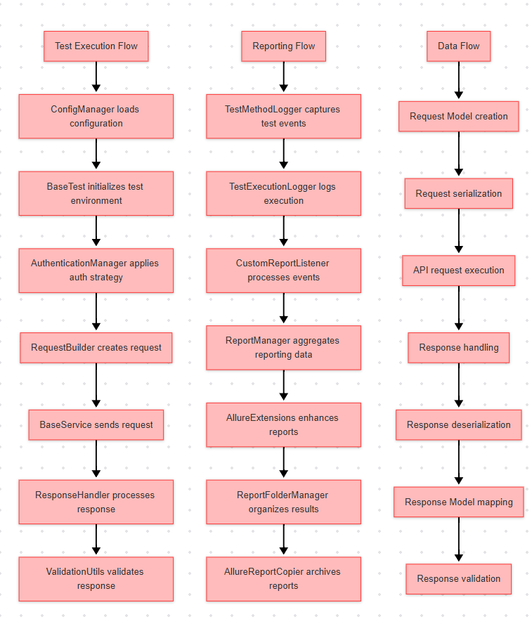
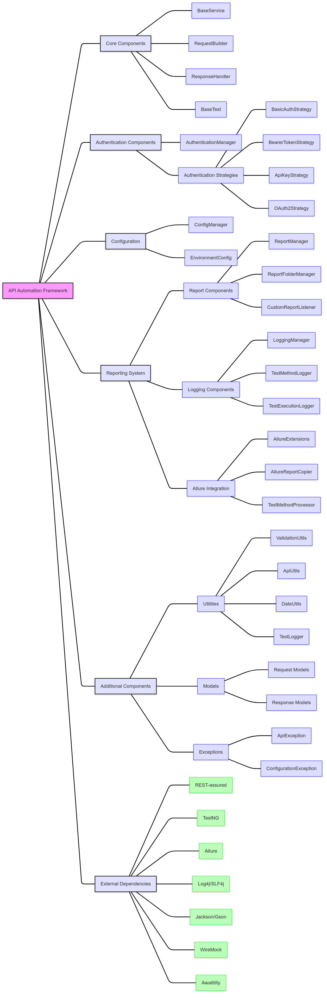

# ✅ API Automation Framework with Java and Rest Assured

This framework provides a robust solution for API test automation with features for authentication, reporting, and test management.



## Package Structure


The framework is organized into the following packages:

- `com.gtrxone.auth`: Authentication-related classes (strategies, managers)
- `com.gtrxone.config`: Configuration-related classes (config manager, environment config)
- `com.gtrxone.core`: Core framework classes (base service, request builder, response handler)
- `com.gtrxone.exceptions`: Exception classes (API exceptions, configuration exceptions)
- `com.gtrxone.models`: Model classes (request/response models)
- `com.gtrxone.reporting`: Reporting-related classes (report manager, listeners)
- `com.gtrxone.services`: Service classes (API service implementations)
- `com.gtrxone.utils`: Utility classes (validation, logging)

## Features

### Authentication
The framework supports multiple authentication strategies:
- Basic Authentication
- Bearer Token Authentication
- API Key Authentication
- OAuth 2.0 Authentication

### Reporting
- Allure reporting integration
- Custom report listeners
- Test method execution logging
- Report folder management

### Test Management
- Base test class with lifecycle hooks
- Test method processors
- Test execution logging

### Utilities
- Validation utilities
- Logging utilities
- Configuration management

## Centralized Logging System

The framework uses a centralized logging system based on Log4j 2. This system provides:

- Console logging for immediate feedback
- File logging for persistent records
- Configurable log levels
- Automatic log file rotation and archiving
- Automatic logging of test method execution

Each test method execution is automatically logged to the log file, including:
- When a test method starts
- When a test method completes (with status: PASSED, FAILED, or SKIPPED)
- Any exceptions that occur during test execution

For more details, see the [logs/README.md](logs/README.md) file.

## Custom Reporting Configuration

The framework supports custom reporting folders and maintaining a history of test execution reports for analysis.

### Configuration Properties

The following properties can be configured in `config.properties`:

```properties
# Logging Configuration
logging.directory=.
logging.file.enabled=true

# Reporting Configuration
reporting.logDir=.
reporting.screenshotDir=.
reporting.customResultsDir=.
reporting.maxReportHistory=10
reporting.useTimestampedFolders=true
```

- `logging.directory`: The directory where log files will be stored (set to project root)
- `reporting.logDir`: The directory where report logs will be stored (set to project root)
- `reporting.screenshotDir`: The directory where screenshots will be stored (set to project root)
- `reporting.customResultsDir`: The base directory where custom Allure results will be stored (set to project root)
- `reporting.maxReportHistory`: The maximum number of report folders to keep (only applicable when using timestamped folders)
- `reporting.useTimestampedFolders`: Whether to use timestamped folders for reports (true/false)

## Running Tests

To run the tests, use the following Maven command:

```bash
mvn clean test
```

This will execute all tests defined in the TestNG suite and generate reports in both the default and custom locations.

## License

This project is licensed under a Proprietary and Confidential license - see the [LICENSE](LICENSE) file for details.

## Author and Copyright

Author: R N W Gunawardana

Copyright © 2025 R N W Gunawardana. All rights reserved.

## AI Training Restriction Notice

Use of this codebase for training artificial intelligence and machine learning models is strictly prohibited without explicit written permission from R N W Gunawardana. Any unauthorized use for AI/ML training purposes will be considered a violation of intellectual property rights and may result in legal action.
